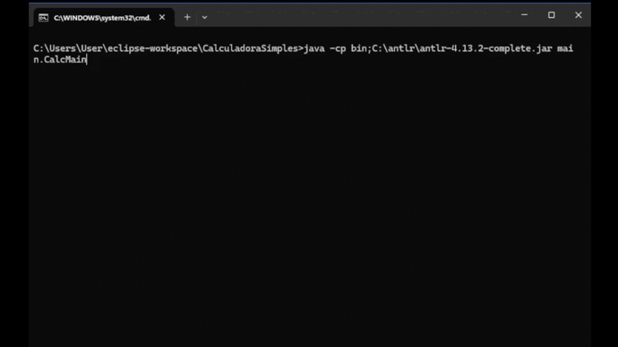

# 🚀 CalculadoraSimples com ANTLR 4

Este projeto é uma calculadora simples desenvolvida em Java utilizando o ANTLR 4.13.2 para análise e interpretação de expressões aritméticas, variáveis e comandos de entrada e saída.



## 🛠️ Passo 1: Instalar o ANTLR 4.13.2

Siga as instruções de instalação de acordo com seu sistema operacional:

### Linux

```bash
cd /usr/local/lib
sudo curl -O https://www.antlr.org/download/antlr-4.13.2-complete.jar

export CLASSPATH=".:/usr/local/lib/antlr-4.13.2-complete.jar:$CLASSPATH"
alias antlr4='java -jar /usr/local/lib/antlr-4.13.2-complete.jar'
alias grun='java org.antlr.v4.gui.TestRig'
```

### Windows

1. Baixe o arquivo JAR do ANTLR [aqui](https://www.antlr.org/download/antlr-4.13.2-complete.jar) e coloque-o em um diretório, por exemplo `C:\antlr`.
   
2. Configure a variável de ambiente `CLASSPATH`:

   ```cmd
   set CLASSPATH=%CLASSPATH%;C:\antlr\antlr-4.13.2-complete.jar
   ```

3. Configure o alias `antlr4` no seu prompt de comando:

   ```cmd
   doskey antlr4=java -jar C:\antlr\antlr-4.13.2-complete.jar $*
   ```

### macOS

```bash
cd /usr/local/lib
curl -O https://www.antlr.org/download/antlr-4.13.2-complete.jar

export CLASSPATH=".:/usr/local/lib/antlr-4.13.2-complete.jar:$CLASSPATH"
alias antlr4='java -jar /usr/local/lib/antlr-4.13.2-complete.jar'
alias grun='java org.antlr.v4.gui.TestRig'
```

## 🧱 Passo 2: Gerar Lexer e Parser a partir da gramática `.g4`

Neste repositório, os arquivos 'Lexer' e 'Parser' já estão gerados no diretório `src/antlr4`. Caso queira gerá-los novamente, apenas garanta que estejam dentro do pacote 'antlr4'. Para garantir que os arquivos sejam gerados no pacote correto, use o comando abaixo estando dentro do diretório src:

```bash
antlr4 -Dlanguage=Java Gramatica.g4 -o antlr4 
```

## 🎯 Passo 3: Compilar e Executar o Projeto

### Compilar o Código

Para compilar o código-fonte, use o comando `javac` dentro do diretório projeto `CalculadoraJava_Compiladores`:

```bash
javac -d bin -cp C:\antlr\antlr-4.13.2-complete.jar src\main\*.java src\antlr4\*.java
```

### Linha de Comando

Após compilar e ainda dentro do diretório projeto `CalculadoraJava_Compiladores`, execute a classe `CalcMain` com:

```bash
java -cp bin;C:\antlr\antlr-4.13.2-complete.jar main.CalcMain
```

### No Eclipse

1. Certifique-se de que o JAR do ANTLR está incluído no build path do projeto:
   - Clique com o botão direito no projeto no Eclipse.
   - Selecione `Build Path` > `Configure Build Path`.
   - Na aba `Libraries`, adicione o JAR do ANTLR (se ainda não estiver adicionado).

2. Clique com o botão direito na classe `CalcMain.java` dentro do Eclipse.
3. Selecione `Run As` > `Java Application`.

Se o projeto estiver configurado corretamente, você verá a execução da calculadora diretamente no terminal ou na interface do Eclipse.

---

## 📝 Exemplo de Uso

A calculadora aceita expressões como:

| Entrada                  | Resultado Esperado           | Observações                                                      |
|--------------------------|-------------------------------|------------------------------------------------------------------|
| `9 + 8`                  | `Resultado da expressão: 17.0` | Expressão simples de adição                                        |
| `10 - 2 * 3`             | `Resultado da expressão: 4.0`  | Expressão com operadores de adição e multiplicação                  |
| `4 * (6 + 2)`            | `Resultado da expressão: 32.0` | Expressão com parênteses e multiplicação                           |
| `(4 + 6) * 2`            | `Resultado da expressão: 20.0` | Expressão com parênteses e multiplicação                           |
| `8 / 4`                  | `Resultado da expressão: 2.0`  | Expressão simples de divisão                                      |
| `4 + 6 * 2 - 8 / 4`      | `Resultado da expressão: 14.0` | Expressão com operadores de adição, multiplicação e divisão       |
| `print(4 + 6)`           | `Resultado da expressão: 10.0` | Comando de impressão com adição                                   |
| `print(3 + 5 * 2 - 8 / 4)` | `Resultado da expressão: 7.0` | Comando de impressão com operadores de adição, multiplicação e divisão |
| `print(4 + 6 * 2 - 8 / 4)` | `Resultado da expressão: 14.0` | Comando de impressão com operadores de adição, multiplicação e divisão |
| `3 + 5 * (2 - 1`         | `Erro de sintaxe na linha 1:13 missing ')' at '\n'` | Parênteses não fechados corretamente                                |
| `8 & 4`                  | `Erro de sintaxe na linha 1:8 token recognition error at: '&'` | Operador não reconhecido                                        |
| `(4 + 6 * 2`            | `Erro de sintaxe na linha 1:13 missing ')' at '\n'` | Parênteses não fechados corretamente                                |
| `4 + (6 * 2`            | `Erro de sintaxe na linha 1:10 missing ')' at '\n'` | Parênteses não fechados corretamente                                |

## 🔗 Links úteis

- [ANTLR](https://www.antlr.org/)
- [ANTLR GitHub](https://github.com/antlr/antlr4)